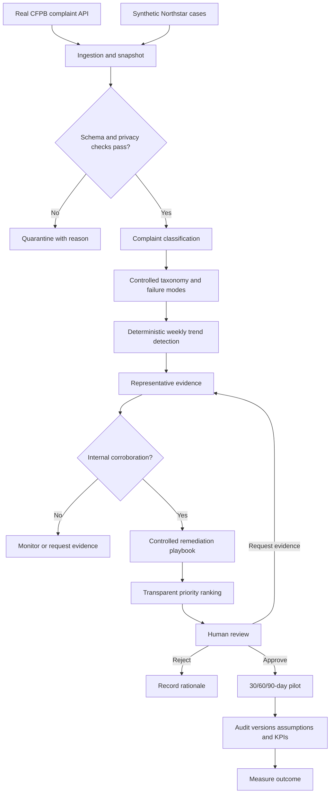

# Architecture

## Product flow

## Technical boundaries

- **Next.js web application:** five reviewer-facing screens.
- **FastAPI service:** typed APIs and workflow orchestration.
- **PostgreSQL:** normalized complaints, model runs, signals, plans, and audit events.
- **Model boundary:** structured classification under a controlled taxonomy.
- **MVP decision:** unsupervised clustering failed the feasibility gate; deterministic taxonomy trends replace it.
- **Deterministic boundary:** validation, privacy rules, trend calculations, ranking, state transitions, and audit writes.
- **Demo reliability:** fixed snapshot and precomputed seeded run; live refresh is optional.

## Required lineage

Every derived object retains its data snapshot, algorithm/model version, taxonomy version, and upstream IDs. Every mutation records an audit event in the same transaction.
